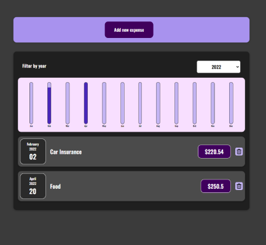
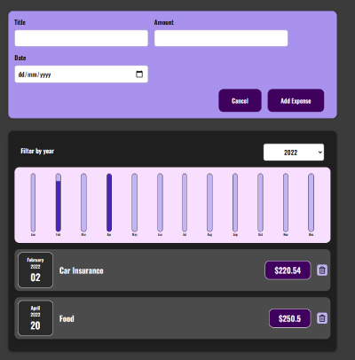

# Task Traker

It's a Tasks tracker react app

You can Add your tasks and back to them later then delete the task you made it

  
  

<b>Live:</b> https://ag-tasktracker.netlify.app/

If you're a developer you can download the code 

# to run app 🛠️

<ul>
  <li>npm i</li>
  <li>npm start</li>
</ul>

